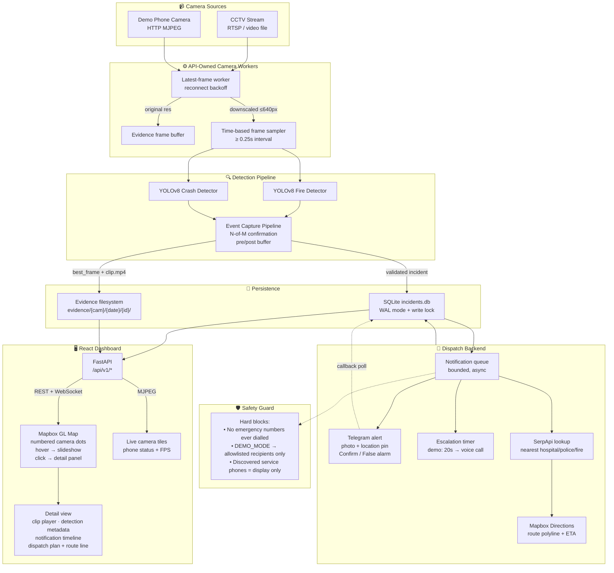

# Architecture

## System Flow



## Key Design Decisions

| Decision | Rationale |
|----------|-----------|
| Single SQLite file, WAL mode | Single-process API; no distributed DB needed; WAL avoids reader/writer lock contention |
| Evidence as files, not blobs | Clip seek via HTTP Range; no 50 MB blobs in SQLite; filesystem is the natural choice |
| Detection downscale separate from evidence | Evidence stays original resolution for judge review; detection runs at 640px for speed |
| Write lock + WAL together | WAL handles reader/writer; process lock serialises competing writer threads (multiple cameras) |
| Notification queue after insert | Encoder thread never blocks on network I/O; durable record exists before any dispatch |
| Straight-line fallback routes | Mapbox Directions may be unavailable; geometric fallback is clearly labelled |
| DEMO_MODE as default | Safety-first: real emergency numbers are never contacted without explicit operator configuration |

## Directory Layout

```
WomenSafety/
├── api/
│   ├── core/config.py          # All settings, env-loaded
│   ├── models/
│   │   ├── camera.py           # Camera registry (config/cameras.json)
│   │   └── incident_v2.py      # CCTV incident schema
│   ├── routes/
│   │   ├── cameras.py          # Status, live MJPEG, demo trigger
│   │   ├── map.py              # /map/groups (camera-grouped incidents)
│   │   ├── incidents_v2.py     # CRUD + WebSocket push
│   │   ├── evidence.py         # File serving with HTTP Range
│   │   └── nearby_services.py  # SerpApi lookup endpoint
│   └── services/
│       ├── camera_workers.py   # Multi-camera frame loop
│       ├── detection_service.py# Fire/crash YOLO inference
│       ├── event_capture.py    # N-of-M confirmation + encoding
│       ├── notification_service.py # Telegram + call + escalation
│       ├── dispatch_routing.py # Route planning + Mapbox cache
│       └── safety_guard.py     # Hard phone-number blocks
├── config/cameras.json         # Camera registry
├── frontend/
│   ├── src/pages/MapView.jsx   # Main hackathon dashboard
│   └── src/index.css           # Projector-optimised styles
├── evidence/                   # Generated evidence files
├── incidents.db                # SQLite database
└── docs/
    ├── ARCHITECTURE.md         # This file
    ├── DEMO_SCRIPT.md          # 3-minute demo walkthrough
    └── LIMITATIONS.md          # Honest scope disclosure
```
